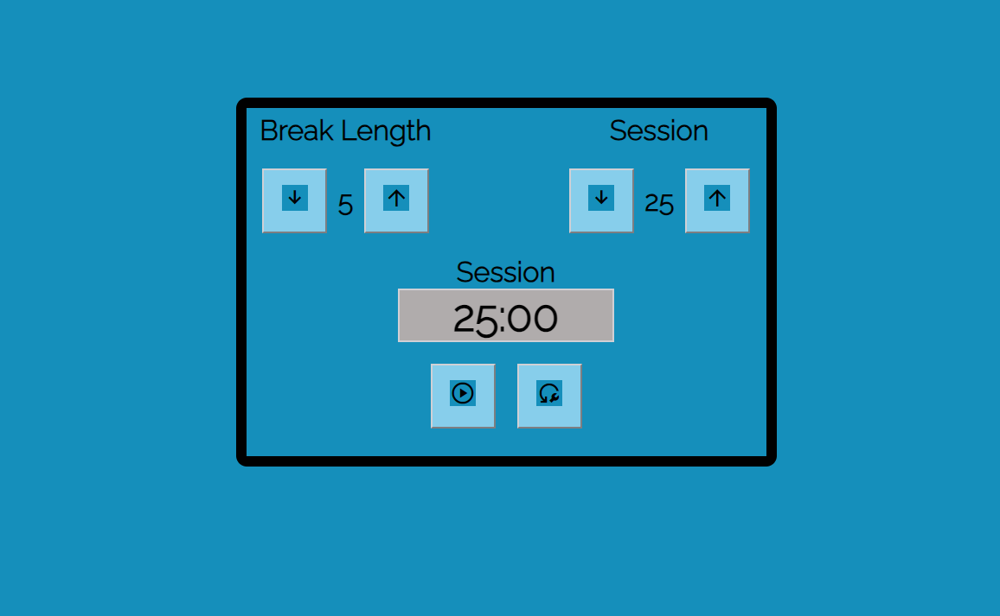
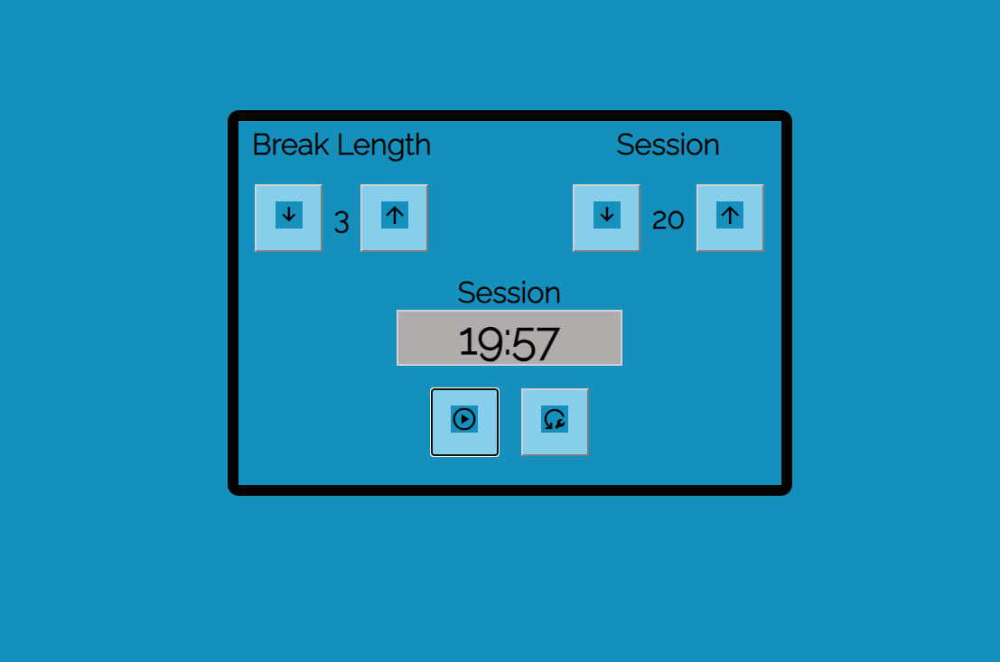

# WorkWave Timer

## 1. Intro.

- Tech stack: HTML, CSS, Javascript
- User stories:
   - The default mode for 
      - break time: 5 minutes
      - session set: 25 minutes
   - Modification:
      - break time: users can be modified to a minimum of 0 minute and a maximum of 60 minutes
      - session set: users can be modified to a minimum of 10 minutes and a maximum of 60 minutes
   - When the session time elapses, the timer should ring the bell indicating the end of the session,and then followed by the start of the break time.
   - When the time left approached 5 minutes, the timer should display a signal with a red text notifying that the break time's begun.
   - When the break time is reached, the second ring bell will get you notified too. That is the life-cycle of each session encompassing the break time.
   - When the `Reset` button is clicked, all activities must get refreshed from its default mode
   - Bonus: The left button named `Play` at the last row indicates that when the bell is ringing, if this button is clicked, the bell will force to stop sounding as well.

## 2. Preview

